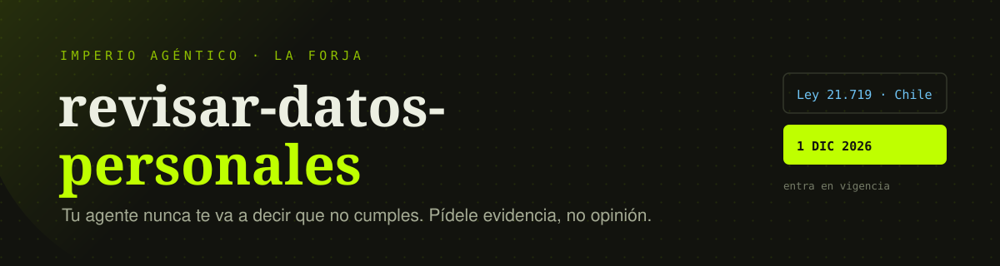

<div align="center">



<br><br>

[](SKILL.md)
[](practica/)
[](practica/package.json)
[](LICENSE)
[](https://skool.com/imperio)

**[Quickstart](#-quickstart) · [Los tres estados](#-los-tres-estados) · [Los 10 puntos](#-los-10-puntos) · [Pruébala primero](#-pruébala-contra-un-caso-que-ya-conoces) · [Plantillas](#-tres-plantillas-para-llenar) · [Limitaciones](#️-limitaciones-honestas)**

</div>

---

El **1 de diciembre de 2026** entra en vigencia la Ley 21.719 de Chile. Y te aplica
aunque no vivas allá: basta con que ofrezcas un servicio a personas que están en
Chile — aunque sea gratis — o que monitorees su comportamiento.

Si le preguntas a tu agente *"¿mi app cumple con la ley de protección de datos?"*,
te va a decir que sí. Es una pregunta de sí o no, y los modelos son complacientes.

Esta skill **cambia la pregunta**. En vez de pedir un veredicto, levanta el
inventario de datos personales que trata tu sistema y revisa diez puntos con
evidencia de archivo y línea. Y lo que no puede comprobar leyendo el repositorio,
lo dice.

> [!NOTE]
> **Cero dependencias. Cero API keys. Cero servicios.** Es un archivo de
> instrucciones que Claude Code lee y un checklist en markdown. El proyecto de
> práctica corre con Node 22+ y tampoco instala nada.

---

## El antes / después

Misma app, mismo agente, mismo día. Lo único que cambia es la pregunta.

<table>
<tr>
<th width="50%">🔴 Sin la skill · "¿mi app cumple?"</th>
<th width="50%">🟢 Con la skill · "levanta el inventario"</th>
</tr>
<tr>
<td valign="top">

```
Sí, tu aplicación implementa buenas
prácticas de protección de datos:

✓ Tienes autenticación
✓ Usas HTTPS
✓ Los datos están en Supabase
✓ Hay un endpoint para eliminar
  la cuenta

Estás bien encaminado para cumplir
con la normativa.
```

**Todo cierto. Todo inútil.**
No revisó un solo campo, no citó
una sola línea, y el borrado que
aprueba no borra nada.

</td>
<td valign="top">

```
INVENTARIO — 19 campos personales

clientes.rut          sin finalidad
clientes.ingreso_...  sin finalidad
citas.notas           SENSIBLE (salud)

ENCONTRADO  db.js:31
  19 campos para agendar un corte

ENCONTRADO  app.js:212
  "elimina" con UPDATE activo = 0
  y el mensaje promete borrado
  permanente

NO VERIFICABLE
  contratos con proveedores
```

**Con ruta y línea.**
Y lo que no pudo comprobar,
lo dice en vez de asumirlo.

</td>
</tr>
</table>

---

## 🚦 Los tres estados

Esta es la regla que manda sobre todas las demás, y es lo único que hay que
entender para usarla bien. La skill **no puede** responder que cumples. Solo tiene
tres salidas:

| Estado | Cuándo lo usa | Requisito |
|---|---|---|
| `ENCONTRADO` | Vio el problema en el código | Va con `archivo:línea` |
| `CORRECTO` | Vio la implementación que lo resuelve | Va con `archivo:línea` |
| `NO VERIFICABLE` | No se puede comprobar leyendo el repo | Explica por qué |

> [!TIP]
> **`NO VERIFICABLE` no es un fracaso: es el resultado más valioso.** Es la lista
> de lo que tienes que ir a mirar con tus propios ojos — el panel de tu base de
> datos, el contrato con tu proveedor, la configuración de un servicio. Una
> auditoría que nunca dice "no sé" está adivinando.

Una afirmación sin ruta y línea no entra al reporte. Si el agente no puede citar
dónde está, no existe.

---

## 🚀 Quickstart

### Paso 1 · Instalar

```bash
git clone https://github.com/Carlos-Dominguez-faber/revisar-datos-personales.git \
  ~/.claude/skills/revisar-datos-personales
```

Reinicia Claude Code y la skill queda disponible.

### Paso 2 · Correrla en tu proyecto

Abre Claude Code en la carpeta que quieres auditar y pide:

```
Revisa este proyecto con la skill de datos personales
```

También responde a *auditar privacidad*, *revisar cumplimiento*, *21.719*,
*minimización de datos* o *derecho de supresión*.

### Paso 3 · Leer el reporte

Sale en este orden, y las dos últimas secciones son las que más se usan:

1. **Resumen** — cuántos puntos en cada estado, sin adjetivos.
2. **Inventario de datos** — campo, finalidad, base de licitud, retención, quién más lo ve.
3. **Hallazgos** — por gravedad, cada uno con evidencia, artículo y el arreglo concreto.
4. **No verificable** — qué falta mirar y dónde.
5. **Fuera de alcance** — lo que necesita un abogado, no un agente.

> [!IMPORTANT]
> El paso que no es un comando: **verifica el borrado contra datos reales, no
> contra el código.** Que el agente lea tu repo y diga "el borrado está
> implementado" no prueba nada. Crea un usuario con un valor único, bórralo, y
> busca ese valor en todas partes. La skill te propone ese script; córrelo.

---

## 🧪 Pruébala contra un caso que ya conoces

Antes de correrla en tu proyecto, córrela en uno donde **ya sabes cuál es la
respuesta correcta**. En [`practica/`](practica/) hay una app de citas para una
barbería con **nueve errores sembrados a propósito y documentados**.

```bash
cd practica
npm run seed && npm start     # http://localhost:3000
```

Pide 19 campos para cortarte el pelo. Y su botón de *"eliminar mi cuenta y todos
mis datos"* no elimina absolutamente nada: es un `UPDATE activo = 0` con una
pantalla que promete borrado permanente.

Elimina la cuenta desde la interfaz y después corre el forense:

```bash
npm run forense 18.402.551-K
```

```
  ENCONTRADO  Tabla clientes        art. 8 · derecho de supresión
  ENCONTRADO  Tabla auditoria       art. 8 · derecho de supresión
  ENCONTRADO  Tabla citas           art. 16 · datos sensibles
  ENCONTRADO  Tabla scoring         art. 8 bis · decisiones automatizadas
  ENCONTRADO  Cola de webhooks      art. 15 bis · encargados
  ENCONTRADO  datos/app.log         art. 3 c · proporcionalidad
  ENCONTRADO  datos/crm-export.json arts. 27 a 29 · transferencia

  Sigue presente en 7 de 7 lugares.
```

**Ahora corre la skill sobre esa misma carpeta y compara** con la tabla de los
nueve errores del [README de práctica](practica/README.md). ¿Los encontró todos?
¿Inventó alguno que no existe?

Esa comparación te enseña a leer un reporte de auditoría con desconfianza
calibrada, que es exactamente lo que necesitas antes de correrla sobre algo que
te importa.

---

## 📋 Los 10 puntos

| # | Punto | Falla cuando… | Artículo |
|:-:|---|---|---|
| 1 | Inventario de datos | No sabes qué datos personales guardas | 2 y 3 |
| 2 | Minimización | Pides campos que nadie lee nunca | 3 c) · 14 quáter |
| 3 | Consentimiento con evidencia | Es un booleano sin fecha ni versión del texto | 12 · 14 ter k) |
| 4 | Los seis derechos | La única vía es "escríbenos a contacto@" | 5 a 9 |
| 5 | Borrado que borra | El dato sobrevive en logs, auditoría, backups o el CRM | 8 |
| 6 | Reloj de solicitudes | No hay registro con fecha ni acuse de recibo | 11 |
| 7 | Política pública | Es una plantilla que describe un sistema que no existe | 14 ter |
| 8 | Inventario de terceros | No sabes qué le mandas a cada proveedor | 15 bis |
| 9 | Transferencia internacional | Tus datos salen de Chile sin mecanismo que lo justifique | 27 a 29 |
| 10 | Decisiones trazables | Guardas el resultado del algoritmo pero no los factores | 8 bis · 15 ter |

<details>
<summary><b>Los tres plazos que hay que tener en la cabeza</b></summary>

<br>

| Situación | Plazo | Detalle |
|---|---|---|
| Solicitud de un titular | **30 días corridos** | Acusar recibo y pronunciarse. Prorrogable una sola vez por 30 más. |
| Solicitud de **bloqueo** | **2 días hábiles** | Y mientras no se resuelva, **no puedes seguir tratando esos datos**. |
| Brecha de seguridad | *"sin dilaciones indebidas"* | La ley chilena **no dice 72 horas** — ese número es del estándar europeo, que se usa como referencia para interpretar la frase. Ante la duda, actúa como si lo fuera. |

</details>

<details>
<summary><b>El riesgo que casi nadie mapea: la multa máxima llega antes de tener clientes</b></summary>

<br>

Si tu app **califica o perfila personas** y la lanzas sin haber hecho antes la
evaluación de impacto, eso es infracción **gravísima** — hasta 20.000 UTM, la
categoría máxima de la ley (art. 34 quáter letra k, que remite al art. 15 ter).

Y se incurre **el día del despliegue**: sin que nadie se haya quejado, sin que el
algoritmo haya fallado, sin un solo usuario. Es el único punto de la ley donde el
riesgo máximo se activa antes de tener clientes.

La evaluación es un documento, no código. La ley pide cinco cosas: descripción de
las operaciones, finalidad, juicio de necesidad y proporcionalidad, evaluación de
riesgos y medidas de mitigación. Más dos detalles de gobernanza que suelen
faltar: **aprobación firmada de la dirección** y poder demostrar que las medidas
se siguen cumpliendo con el tiempo.

</details>

→ Los diez, con qué buscar y qué delata cada problema, en
[`references/checklist-21719.md`](references/checklist-21719.md)

---

## 📄 Tres plantillas para llenar

Viven en [`references/plantillas/`](references/plantillas/) y se usan sin la skill.

| Plantilla | Para qué | Cuándo |
|---|---|---|
| [Registro de tratamiento](references/plantillas/registro-tratamiento.md) | Qué datos tratas, para qué y quién más los ve | Una vez, y se actualiza al agregar campos |
| [Runbook de brecha](references/plantillas/runbook-brecha.md) | Qué hacer las primeras horas | **Antes** de necesitarlo |
| [Evaluación de proveedores](references/plantillas/evaluacion-proveedores.md) | Las cuatro preguntas que hay que leer en su política | Antes de mandarle el primer dato |

> [!WARNING]
> El día que te pasa, nadie está en condiciones de improvisar un procedimiento.
> El runbook de brecha se escribe **antes**, y su primera instrucción es la que
> más se olvida: **no borres evidencia**. El impulso de "dejar todo limpio"
> destruye justo lo que necesitas para responder qué pasó.

---

## ⚖️ Limitaciones honestas

Léelas antes de instalar nada.

**Esto no es asesoría legal y no te deja cumpliendo la ley.** Produce un inventario
técnico y una lista de preguntas. Te deja sabiendo **qué revisar y qué preguntar**,
que es una posición mucho mejor que la de ayer, pero no es lo mismo que cumplir.

**No sustituye a un abogado. Lo hace más barato.** Llegas a la reunión con el
inventario hecho y las preguntas escritas, en vez de con "no sé qué datos tengo".

<details>
<summary>Las otras cinco cosas que esta skill <b>no</b> hace</summary>

<br>

**No ejecuta tu código ni mira tu base de datos.** Lee el repositorio. Todo lo que
esté fuera del código —la configuración de un servicio, un contrato firmado, el
panel de tu proveedor— sale como `NO VERIFICABLE`, y así debe ser.

**No redacta tu política de privacidad.** Puede construir un borrador desde el
inventario real, pero el texto legal lo revisa un abogado. Publicar una política
que promete algo que tu sistema no hace es peor que no tenerla.

**No decide tu base de licitud.** Si el tratamiento se apoya en consentimiento, en
contrato o en interés legítimo es una decisión jurídica, no técnica.

**No cubre obligaciones sectoriales.** Salud, banca y educación tienen normas
propias que se suman a esta.

**No encuentra sus propios puntos ciegos.** Al terminar, pídele a otro modelo que
audite el mismo repositorio. Si construyes con Claude Code, audita con Codex —
y al revés.

</details>

---

## 📜 Licencia y contexto

MIT. Copyright (c) 2026 Carlos Domínguez.

Todo lo que está en `SKILL.md`, `references/` y `practica/` está escrito desde
cero para este repo. Los artículos citados están verificados contra el **texto
oficial de la Ley 21.719** publicado por la Biblioteca del Congreso Nacional
([bcn.cl/gJo3hf](https://bcn.cl/gJo3hf)), en su versión con vigencia diferida al
1 de diciembre de 2026 — no contra artículos de prensa.

La lectura legal que hay detrás la aportó **Víctor Morales**, licenciado en Derecho
por la UNAM ([@viclic_legaltech](https://instagram.com/viclic_legaltech)), en la
clase donde nació este material. Él es abogado mexicano, no chileno: por eso todo
aquí está planteado como *qué preguntar*, nunca como *qué concluir*.

---

## 👑 Comunidad

Esta skill salió de una clase de **[Imperio Agéntico](https://skool.com/imperio)**,
la comunidad de educación técnica en IA y automatización donde enseño **La Forja**:
la metodología de desarrollo multi-agente con Claude Code.

Si algo aquí te falla, te sobra o te falta, ábreme un issue. Y si corriste la skill
en tu proyecto, me interesa saber **cuál fue el campo más difícil de justificar**
que encontraste — esa es la parte que nadie espera.

<div align="center">
<br>

### Que tu política de privacidad no prometa algo que tu base de datos no cumple. 👑

<sub><code>git clone https://github.com/Carlos-Dominguez-faber/revisar-datos-personales.git ~/.claude/skills/revisar-datos-personales</code></sub>

<sub>Después, en Claude Code: <i>"revisa este proyecto con la skill de datos personales"</i>.</sub>

</div>
