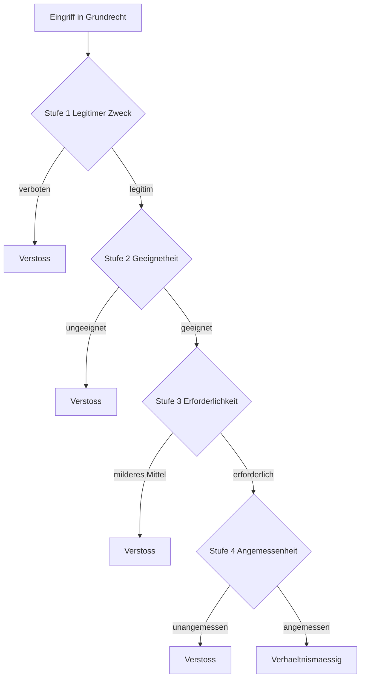
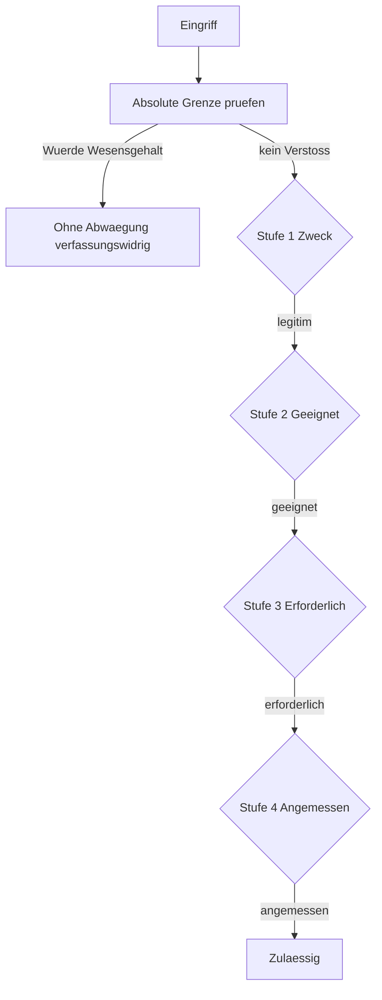
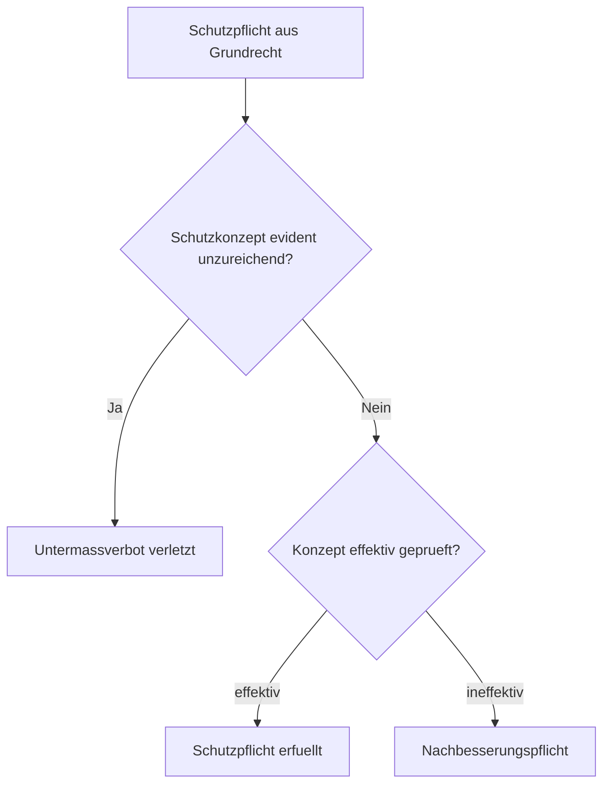

# Mermaid Flowchart Prüfung

## Grundgeruest

## Variante mit absoluten Grenzen

## Variante Schutzpflicht (Untermassverbot)

## Anwendungstipps

- In Markdown-Datei zwischen drei Backticks mit mermaid einbetten.
- GitHub rendert Mermaid automatisch in Wiki und in normalen Repos.
- Bei Klausur als Skizze auf Papier reproduzierbar.
- Knoten mit Fallnummern beschriften für den jeweils zu prüfenden
  Sachverhalt.
