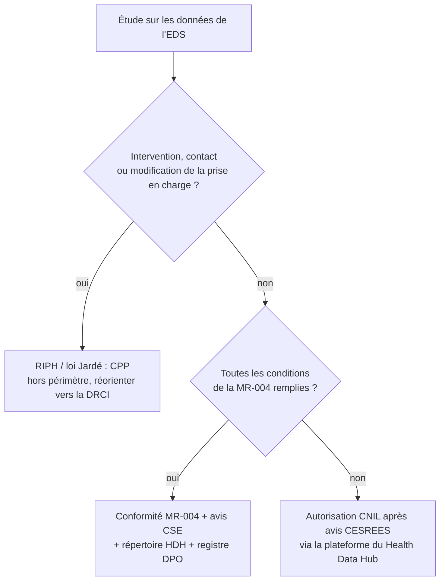

# Regulatory framework for EDS studies (France)

This skill orients; it is **not legal advice**. The hospital's DPO (délégué à la protection des données) and the scientific and ethical committee of the EDS have the last word, and rules change: every date, threshold or article number below that is not marked as verified must appear in a protocol as « à vérifier auprès du DPO ». The CHU-specific names (committee, DRCI, contacts, template of the note d'information) are in `CONTEXT.md` when `/setup-eds-skills` recorded them.

## Which framework applies

Two distinct processing operations exist and are often confused:

1. **The warehouse itself** (constitution and internal reuse of the data). A public hospital creates its EDS either by conformity to the CNIL **référentiel « entrepôts de données de santé »** (délibération n° 2021-118 du 7 octobre 2021) or, when it does not fit the référentiel, by a specific CNIL authorisation. This is the hospital's business, done once; a study does not redo it, but it inherits its conditions (patient information, committee, secure environment, no export).
2. **Each study** carried out on the warehouse is a separate processing with its own formality. That formality is the object of the tree below.

```
La recherche implique-t-elle une intervention sur la personne, un contact
ou une modification de la prise en charge ?
├── oui → RIPH (loi Jardé) : CPP, MR-001/003… hors périmètre de ce skill,
│         le signaler et réorienter vers la DRCI
└── non → réutilisation de données existantes (RNIPH)
    ├── Les conditions de la MR-004 sont-elles toutes remplies ?
    │   (données déjà collectées, pas de contact, patients informés,
    │    pas d'appariement hors périmètre, pas de NIR, données restant
    │    dans l'environnement sécurisé, intérêt public)
    │   ├── oui → engagement de conformité MR-004 (déjà signé par le CHU ?)
    │   │        + avis du CSE de l'EDS
    │   │        + inscription au répertoire public du Health Data Hub
    │   │        + registre des traitements du DPO
    │   └── non → autorisation CNIL après avis du CESREES,
    │            dossier déposé sur la plateforme du Health Data Hub
    └── (l'avis du CSE de l'EDS est requis dans tous les cas)
```



**(a) Internal reuse under the référentiel EDS.** The référentiel covers warehouses built by a health establishment for research, studies, evaluations and management, with data staying inside the establishment's secure environment, a comité scientifique et éthique, a DPO, patient information and a public register of projects. A study run by the CHU's own teams inside that environment starts from here. What the référentiel does *not* do is exempt the study from its own formality (b or c).

**(b) Study within MR-004** (méthodologie de référence, délibération n° 2018-155 du 3 mai 2018). Typical EDS study: research not involving the human person, no contact with patients, data already collected, patients informed (individually, or collectively with justification), no matching outside the allowed perimeter, no NIR, no leaving the secure environment, public interest. The controller signs one engagement de conformité to the CNIL (the CHU has usually done it; check), then each study is **registered in the public répertoire of the Health Data Hub** before starting. Points to check with the DPO: genetic data (restrictions apply), matching with other bases, transfer of data to a partner.

**(c) Study outside MR-004** → CNIL authorisation, after the opinion of the **CESREES** (Comité éthique et scientifique pour les recherches, les études et les évaluations dans le domaine de la santé), dossier filed on the Health Data Hub platform (single window since the loi n° 2019-774 du 24 juillet 2019, à vérifier). Typical triggers: matching with external data (SNDS, cancer registry, death registry with identifiers), patients who cannot be informed, individual data leaving the hospital (multicentre pooling, industrial partner), data from another controller, NIR use. Count months, not weeks.

**(d) Research involving the human person** (RIPH, loi Jardé n° 2012-300 du 5 mars 2012 and its decrees): out of scope, because an EDS study reuses existing data. Flag it as soon as a protocol adds a questionnaire, a phone call, a sample, a new examination, a randomisation or any change in care: the study becomes a RIPH (category 1, 2 or 3), needs a CPP opinion and another CNIL methodology (MR-001/MR-003), and must go through the DRCI.

Legal bases usually cited, to check with the DPO: RGPD art. 6 (licéité: mission d'intérêt public for a public hospital), art. 9 (données de santé, exception recherche), art. 89 (garanties pour la recherche); loi Informatique et Libertés n° 78-17 modifiée, chapter on health data (art. 64 et suivants, à vérifier); Code de la santé publique art. L.1461-1 et suivants for SNDS / Health Data Hub (à vérifier). Do not add article numbers beyond these unless checked.

## Étapes pour une étude sur l'EDS du CHU (checklist)

À reprendre dans `02-protocole.md` et dans `README.md` de l'étude, avec la date et le numéro de chaque pièce.

1. **Cadre applicable** décidé avec l'arbre ci-dessus et confirmé par le DPO (MR-004 ou autorisation CNIL/CESREES ; RIPH exclue).
2. **Avis du comité scientifique et éthique (CSE) de l'EDS** : protocole soumis, avis favorable obtenu (date, numéro) ; les réserves du comité sont intégrées au protocole.
3. **Inscription au registre des traitements** tenu par le DPO (fiche de traitement : finalité, données, durée, destinataires, mesures).
4. **Information des patients** : note d'information individuelle (canal : courrier, portail patient, livret d'accueil, affichage) avec **droit d'opposition** et modalités d'exercice ; ou justification écrite de l'information collective quand l'information individuelle est impossible ou disproportionnée (décédés, effort disproportionné), à faire valider par le DPO. Les patients ayant exercé leur opposition sont exclus de l'extraction.
5. **Déclaration du projet sur le portail du Health Data Hub** (répertoire public des projets, obligatoire pour les études sous MR-004/005/006 ; date, numéro) — avant le début des traitements.
6. **Analyse dans l'environnement sécurisé** de l'EDS : aucune extraction de données individuelles hors de cet environnement ; seuls des résultats agrégés sortent, après contrôle.
7. **Minimisation** : variables limitées à celles du plan d'analyse ; dates réduites au besoin (mois/année si suffisant) ; pseudonymisation ; pas de texte libre sans nécessité justifiée.
8. **Durée de conservation** : période d'analyse puis archivage selon la règle du CHU (référence usuelle : jusqu'à deux ans après la dernière publication, puis archivage ; à vérifier auprès du DPO).
9. **Règles de publication** : masquage des petits effectifs (seuil `CONTEXT.md`, par défaut < 10 ; certains cadres imposent < 11), pas de croisement permettant une ré-identification, relecture des sorties avant diffusion.
10. **Dossier de l'étude** : protocole versionné, avis CSE, récépissé HDH, fiche de registre, note d'information, conservés dans le dossier de l'étude (pas dans `data/`).

## Modèle de section pour le protocole

À insérer tel quel dans `02-protocole.md` et à remplir ; chaque champ non confirmé garde la mention « à vérifier auprès du DPO ».

```markdown
## Aspects réglementaires et éthiques

- **Référentiel applicable et justification** : recherche n'impliquant pas la personne humaine, réutilisation de données de l'entrepôt de données de santé du CHU (référentiel CNIL EDS, délibération n° 2021-118). Étude conforme à la MR-004 / relevant d'une autorisation CNIL après avis du CESREES (rayer la mention inutile), parce que : <appariement externe ? patients informables ? sortie de données ?>. À vérifier auprès du DPO.
- **Finalité et intérêt public** : <question de recherche, bénéfice attendu pour les patients ou le système de soins>.
- **Données traitées et minimisation** : <catégories de données : PMSI, prescriptions, biologie…>, période <dates>, variables limitées au plan d'analyse (`05-plan-analyse.md`), pseudonymisation, absence de NIR, absence de données génétiques (ou justification).
- **Information des patients et droit d'opposition** : <note d'information individuelle, canal et date / information collective et justification>. Les patients ayant exercé leur droit d'opposition sont exclus. À vérifier auprès du DPO.
- **Durée de conservation** : <durée de l'analyse + archivage ; règle du CHU>. À vérifier auprès du DPO.
- **Responsable de traitement et DPO** : CHU de Brest, représenté par <fonction> ; DPO : <contact>. Investigateur principal : <nom, service>.
- **Avis du comité scientifique et éthique de l'EDS** : <date>, <numéro>, <réserves éventuelles et réponse>.
- **Déclaration au Health Data Hub** : <date>, <numéro de répertoire>.
- **Mesures de sécurité** : analyse dans l'environnement sécurisé de l'EDS, accès nominatifs et tracés, aucune exportation de données individuelles, sorties agrégées avec masquage des effectifs < <seuil>, scripts et résultats versionnés dans le dossier de l'étude.
```

## Cautions

- Mark every date, threshold and rule name that the skill has not verified « à vérifier auprès du DPO ». Verified at writing time: référentiel EDS = délibération CNIL n° 2021-118 du 7 octobre 2021; MR-004 = délibération CNIL n° 2018-155 du 3 mai 2018; MR-004 projects must be registered in the Health Data Hub public répertoire. Everything else in this skill is orientation.
- Do not invent article numbers. RGPD art. 6, 9, 89 and CSP art. L.1461-1 et suivants are safe to cite with a note to check; leave other articles to the DPO.
- The DPO and the CSE of the EDS have the last word; a protocol that anticipates their objections (matching, patient information, exports) saves a cycle.
- A study can be scientifically sound and still not proceed: the regulatory section is written **before** feasibility work on real data, and `/feasibility` must not run on patient-level data until the study is registered (or the DPO has confirmed that the counts requested are covered by the warehouse's own formality).
- Any scope change (new data source, new partner, matching, extra variables of a sensitive kind) reopens the tree: update the section, the registre and the HDH record.

## How skills use this skill

- `/study-design` → fills the « Aspects réglementaires et éthiques » section from the template; asks the user the tree questions it cannot answer from `CONTEXT.md`.
- `/feasibility` → checks that step 5 (HDH) or the DPO's confirmation exists before touching patient-level data.
- `/report` → reproduces the avis CSE and HDH references in the methods, and applies the small-cell rule from step 9.
- `/review-study` → checks that every item of the template is filled or marked « à vérifier », that the tree branch is justified, and that any contact with patients has been flagged as RIPH.
